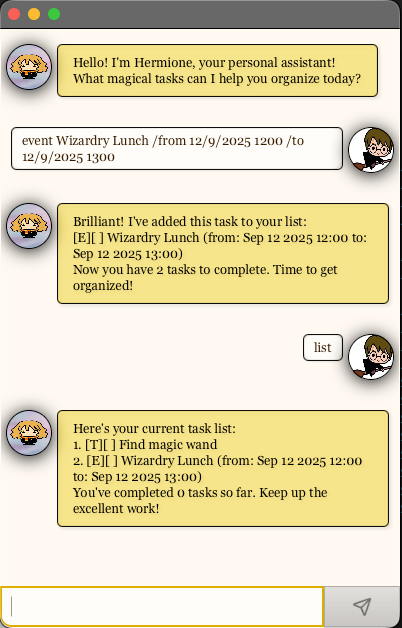

# Hermione User Guide



Meet **Hermione**, the intelligent task management application inspired by the brilliant witch from the Harry Potter series. Just like Hermione Granger's exceptional organizational skills and attention to detail, this application helps you stay on top of all your tasks with magical efficiency.

Whether you're a student juggling assignments, a professional managing multiple projects, or simply someone who wants to organize their daily life, Hermione is here to help you stay organized and productive. With its intuitive command-line interface and powerful features, managing your tasks has never been more magical!

## Getting help

Shows a comprehensive list of all available commands and their usage.

Example: `help` or `h`

Displays all available commands with their descriptions and syntax.

```
Available commands:
1. help (h) - Show this help message
2. bye (b) - Exit the application
3. list (l) - List all items
4. todo (t) {description} - Add a new ToDo task
5. deadline (dl) {description} /by {date} - Add a new Deadline task
6. event (e) {description} /from {start date} /to {end date} - Add a new Event task
7. fixed (fi) {description} /duration {duration} - Add a new Fixed Duration task
8. mark (m) {task number} - Mark a task as completed
9. unmark (um) {task number} - Unmark a task as not completed
10. delete (d) {task number} - Delete a task
11. find (fd) {keyword} - Find tasks containing the keyword
Note: You can use either the full command name or the shorthand in parentheses.
```

## Exiting the application

Safely exits the Hermione application and saves all your tasks.

Example: `bye` or `b`

The application will display a farewell message and close.

```
Bye. Hope to see you soon!
```

## Listing all tasks

Displays all tasks in your task list with their current status.

Example: `list` or `l`

Shows all tasks with their numbers, status (marked/unmarked), and details.

```
Here's your current task list:
1. [T][ ] Read book
2. [D][X] Submit assignment (by: Dec 30 2025 12:00)
3. [E][ ] Team meeting (from: Dec 30 2025 12:00 to: Dec 30 2025 14:00)
You've completed 1 tasks so far. Keep up the excellent work!
```

## Adding a ToDo task

Creates a new simple task without any specific deadline or time constraints.

Example: `todo Read book` or `t Read book`

Adds a new ToDo task to your list and confirms the addition.

```
Brilliant! I've added this task to your list:
[T][ ] Read book
Now you have 1 tasks to complete. Time to get organized!
```

## Adding a Deadline task

Creates a new task with a specific deadline date.

Example: `deadline Submit assignment /by 30/12/2025 1200` or `dl Submit assignment /by 30/12/2025 1200`

Adds a new Deadline task with the specified due date.

```
Brilliant! I've added this task to your list:
[D][ ] Submit assignment (by: Dec 30 2025 12:00)
Now you have 2 tasks to complete. Time to get organized!
```

## Adding an Event task

Creates a new task that spans from a start date to an end date.

Example: `event Team meeting /from 30/12/2025 1200 /to 30/12/2025 1400` or `e Team meeting /from 30/12/2025 1200 /to 30/12/2025 1400`

Adds a new Event task with the specified start and end dates.

```
Brilliant! I've added this task to your list:
[E][ ] Team meeting (from: Dec 30 2025 12:00 to: Dec 30 2025 14:00)
Now you have 3 tasks to complete. Time to get organized!
```

## Adding a Fixed Duration task

Creates a new task with a specific duration that needs to be completed.

Example: `fixed Study for exam /duration 2` or `fi Study for exam /duration 2`

Adds a new Fixed Duration task with the specified duration.

```
Brilliant! I've added this task to your list:
[F][ ] Study for exam (duration: 2 hours)
Now you have 4 tasks to complete. Time to get organized!
```

## Marking a task as completed

Marks a specific task as done by its task number.

Example: `mark 2` or `m 2`

Updates the task status to completed and confirms the change.

```
Fantastic! I've marked this task as completed:
[D][X] Submit assignment (by: Dec 30 2025 12:00)
Well done! You're making excellent progress!
```

## Unmarking a task as not completed

Marks a specific task as not done by its task number.

Example: `unmark 2` or `um 2`

Updates the task status to not completed and confirms the change.

```
No worries! I've marked this task as not done yet:
[D][ ] Submit assignment (by: Dec 30 2025 12:00)
Don't worry, you'll get to it when you're ready!
```

## Deleting a task

Removes a specific task from your task list by its task number.

Example: `delete 3` or `d 3`

Removes the task and confirms the deletion.

```
Right then! I've removed this task from your list:
[E][ ] Team meeting (from: Dec 30 2025 12:00 to: Dec 30 2025 14:00)
Now you have 3 tasks remaining. One less thing to worry about!
```

## Finding tasks

Searches for tasks that contain a specific keyword in their description.

Example: `find assignment` or `fd assignment`

Displays all tasks that match the search keyword.

```
I found these tasks matching your search:
2. [D][X] Submit assignment (by: Dec 30 2025 12:00)
Hope this helps you find what you're looking for!
```

## Command Summary

| Action                 | Format, Examples                                                                                                                                                             |
| ---------------------- | ---------------------------------------------------------------------------------------------------------------------------------------------------------------------------- |
| **Help**               | `help` or `h`                                                                                                                                                                |
| **Exit**               | `bye` or `b`                                                                                                                                                                 |
| **List**               | `list` or `l`                                                                                                                                                                |
| **Add ToDo**           | `todo DESCRIPTION` or `t DESCRIPTION` <br> e.g., `todo Read book`                                                                                                            |
| **Add Deadline**       | `deadline DESCRIPTION /by DATE` or `dl DESCRIPTION /by DATE` <br> e.g., `deadline Submit assignment /by 30/12/2025 1200`                                                     |
| **Add Event**          | `event DESCRIPTION /from START_DATE /to END_DATE` or `e DESCRIPTION /from START_DATE /to END_DATE` <br> e.g., `event Team meeting /from 30/12/2025 1200 /to 30/12/2025 1400` |
| **Add Fixed Duration** | `fixed DESCRIPTION /duration DURATION` or `fi DESCRIPTION /duration DURATION` <br> e.g., `fixed Study for exam /duration 2`                                                  |
| **Mark**               | `mark INDEX` or `m INDEX` <br> e.g., `mark 1`                                                                                                                                |
| **Unmark**             | `unmark INDEX` or `um INDEX` <br> e.g., `unmark 1`                                                                                                                           |
| **Delete**             | `delete INDEX` or `d INDEX` <br> e.g., `delete 1`                                                                                                                            |
| **Find**               | `find KEYWORD` or `fd KEYWORD` <br> e.g., `find assignment`                                                                                                                  |
